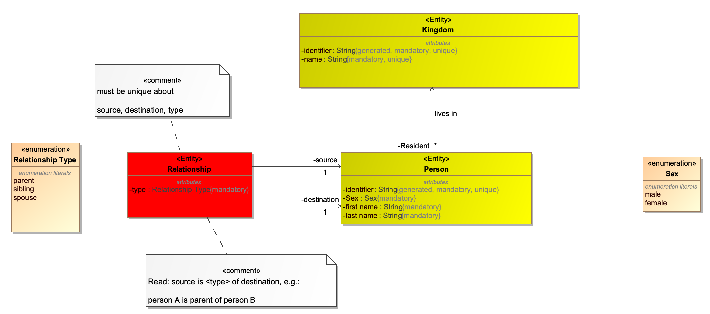
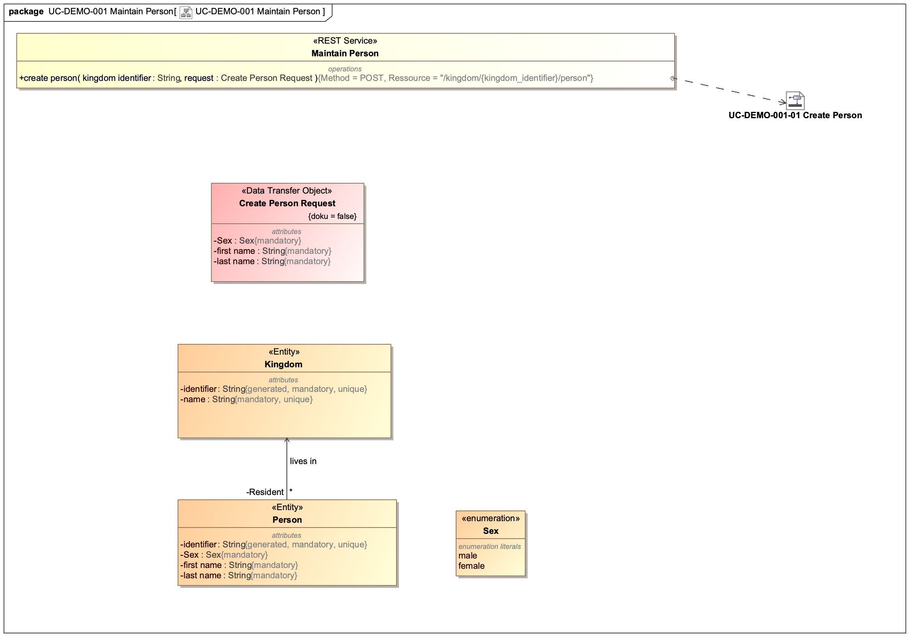
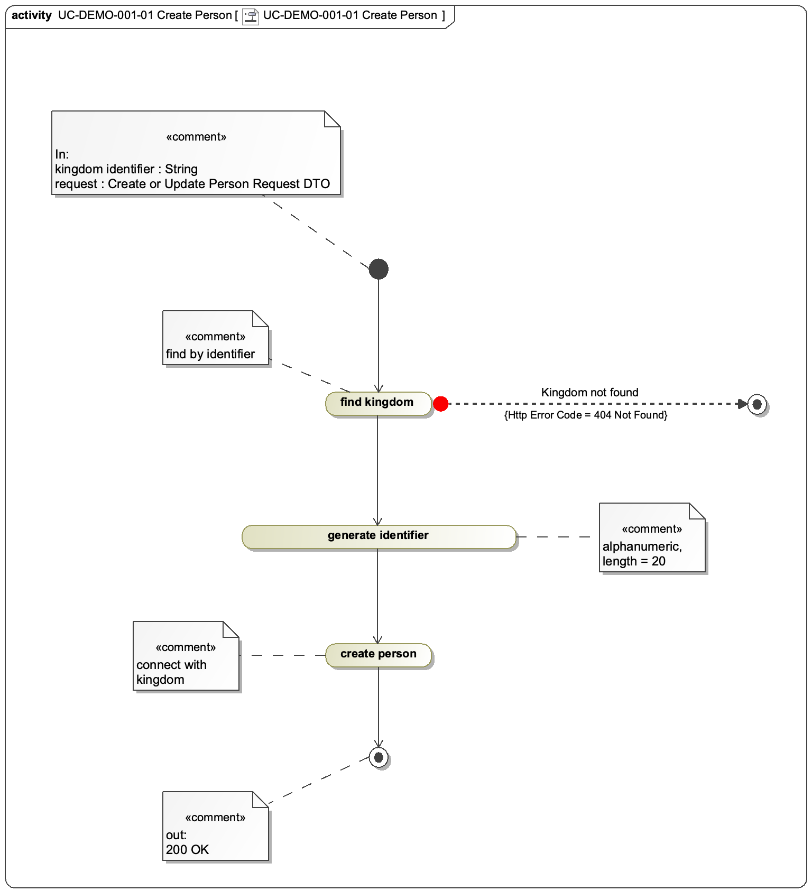
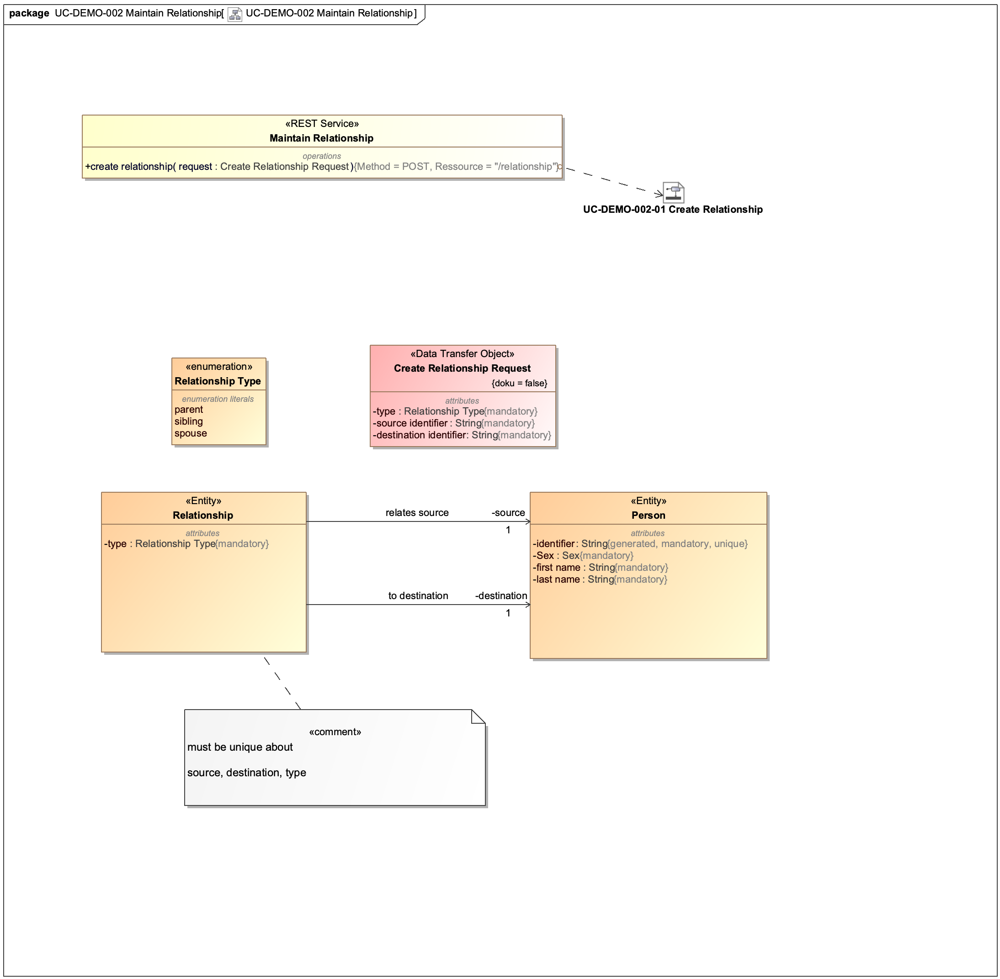
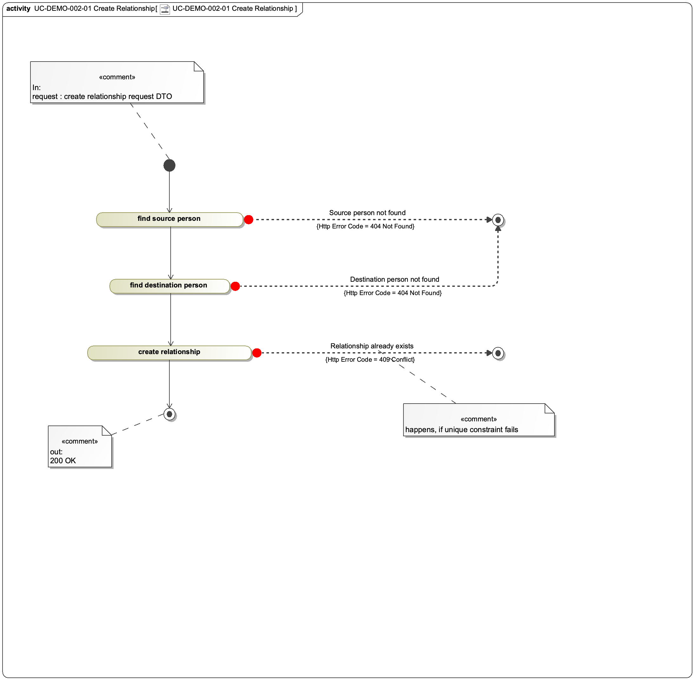

# Demo Project
## Goals

The Demo Project is a Spring Boot Microservice that implements some of the concepts we
use in our productive services. We have created a specification (see chapter "specification") and some tasks you should solve.

The time you need to solve the task should not be more than 4 hours.

## Prerequisites

- java 11
- eclipse with installed lombok
- docker with docker-compose
- maven

We prefer to use mac os or linux. If you use windows, ensure to have UTF-8 as encoding standard in eclipse.

## First steps

### Uncompress

Uncompress the project.

### Postgres

Then run on CLI:

```
./start_for_junit.sh
```

That should start a postgres via docker-compose:

```
dsgvo_demo_postgres_1  | PostgreSQL init process complete; ready for start up.
dsgvo_demo_postgres_1  |
dsgvo_demo_postgres_1  | 2021-02-15 14:14:24.676 UTC [1] LOG:  starting PostgreSQL 13.0 (Debian 13.0-1.pgdg100+1) on x86_64-pc-linux-gnu, compiled by gcc (Debian 8.3.0-6) 8.3.0, 64-bit
dsgvo_demo_postgres_1  | 2021-02-15 14:14:24.676 UTC [1] LOG:  listening on IPv4 address "0.0.0.0", port 5432
dsgvo_demo_postgres_1  | 2021-02-15 14:14:24.677 UTC [1] LOG:  listening on IPv6 address "::", port 5432
dsgvo_demo_postgres_1  | 2021-02-15 14:14:24.682 UTC [1] LOG:  listening on Unix socket "/var/run/postgresql/.s.PGSQL.5432"
dsgvo_demo_postgres_1  | 2021-02-15 14:14:24.689 UTC [74] LOG:  database system was shut down at 2021-02-15 14:14:24 UTC
dsgvo_demo_postgres_1  | 2021-02-15 14:14:24.697 UTC [1] LOG:  database system is ready to accept connections
```

### Run maven

Then start in a second terminal:

```
mvn clean package
```

If everything is fine, the output should look like following:

```
[INFO] Tests run: 3, Failures: 0, Errors: 0, Skipped: 0, Time elapsed: 7.352 s - in com.example.demo.tests.TC_DEMO_001_01_CreatePersonActivityTest
[INFO]
[INFO] Results:
[INFO]
[INFO] Tests run: 3, Failures: 0, Errors: 0, Skipped: 0
[INFO]
[INFO]
[INFO] --- maven-war-plugin:3.3.1:war (default-war) @ demo ---
[INFO] Packaging webapp
[INFO] Assembling webapp [demo] in [/Users/udobischof/git/springtestproject/target/demo-0.0.1-SNAPSHOT]
[INFO] Processing war project
[INFO] Copying webapp resources [/Users/udobischof/git/springtestproject/src/main/webapp]
[INFO] Building war: /Users/udobischof/git/springtestproject/target/demo-0.0.1-SNAPSHOT.war
[INFO]
[INFO] --- spring-boot-maven-plugin:2.4.2:repackage (repackage) @ demo ---
[INFO] Replacing main artifact with repackaged archive
[INFO] ------------------------------------------------------------------------
[INFO] BUILD SUCCESS
[INFO] ------------------------------------------------------------------------
[INFO] Total time:  13.562 s
[INFO] Finished at: 2021-02-15T17:45:10+01:00
[INFO] ------------------------------------------------------------------------
```


Exception like these after first start are normal:


```
org.hibernate.tool.schema.spi.CommandAcceptanceException: Error executing DDL "alter table demo.person drop constraint FKmk9lltni68835tshjc29o14yf" via JDBC Statement
	at org.hibernate.tool.schema.internal.exec.GenerationTargetToDatabase.accept(GenerationTargetToDatabase.java:67) ~[hibernate-core-5.4.27.Final.jar:5.4.27.Final]
	at org.hibernate.tool.schema.internal.SchemaDropperImpl.applySqlString(SchemaDropperImpl.java:375) ~[hibernate-core-5.4.27.Final.jar:5.4.27.Final]
	at org.hibernate.tool.schema.internal.SchemaDropperImpl.applySqlStrings(SchemaDropperImpl.java:359) ~[hibernate-core-5.4.27.Final.jar:5.4.27.Final]
	at org.hibernate.tool.schema.internal.SchemaDropperImpl.applyConstraintDropping(SchemaDropperImpl.java:331) ~[hibernate-core-5.4.27.Final.jar:5.4.27.Final]
```

### Import to eclipse
Import the project into eclipse.

# Specification

## Overview

The following image shows a simple domain model with a couple of domain objects (Entities).



The red domain object "Relationship" is not implemented yet.

## UC-DEMO-001 Maintain Person

### Domain Model



### Activity



## UC-DEMO-002 Maintain Relationship

### Domain Model



### Activity



## How to read

"Maintain Person" is a REST-Service, having one callable method named "create person". When the endpoint / method is called with a POST request and "Create Person Request DTO" as body, the activity "UC-DEMO-001-01 Create Person" is called.

# Tasks

## Preparation
Find and analyze the corresponding classes/methods for

- Maintain Person Endpoint (REST-Service)
- the triggered activity
- the implemented Data Transfer Object
- the Entities (Kingdom and Person)
- The corresponding unit test

Then:

- Analyze precisely the relationship between modeled entities, DTOs, endpoint and activity and corresponding implementations.
- Understand how we specify and implement unit tests.
- Analyze which test cases correspond to the different steps and execution pathes in the modelled activity.
- Find and analyze the implemented DAO-Class.
- Consider that UC-DEMO-002 is not implemented (yet)

## Task 1: Implement UC-DEMO-001-01
Implement exactly as specified:

- REST-Endpoint
- Needed Entity / Enum
- Activity

Use the existing implementation as reference.

## Task 2: Test UC-DEMO-001-01

Specify and implement Unit-Tests with following test cases:

 - testSuccess (a relationship is created successfully)
 - testFailSourcePersonNotFoundException

Define three other tests

## Task 3: Deliver
We want you to deliver a complete implementation with a running test suite (with maven, eclipse is not relevant).

# Conclusion

Good luck. If you have questions: ASK
